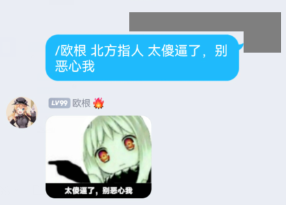

### 欧根画图

#### 【指令】北方指人

以“北方指人”为模板，加上指定文本，生成图片
 
*<子指令>: 北方指人*  
*<指令参数>: 要添加的本文*

>  -> /欧根 北方指人 太傻逼了，别恶心我   
>  <- \[图片\]

#### 【指令】摸

以“摸”为模板，加上at对象头像图片
 
*<子指令>: 摸*  
*<指令参数>: 要添加的本文*

>  -> /欧根 @XXX  
>  <- \[图片\]